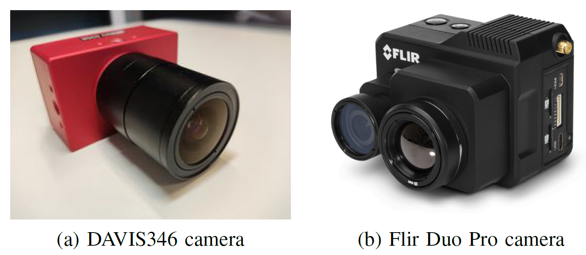

The database is recorded using 2 cameras and a laptop. The
DAVIS346 [1], [9], is used to record events. Its resolution is
346 × 260. For each event [t, x, y, p], x ∈ [0, 345] and y ∈
[0, 259] and the data is saved with the DV software [10].
The RGB and thermal recordings were acquired with the dual
sensor, visible and thermal, camera FLIR Duo R developed by
FLIR Systems [11]. The visible sensor is a CCD sensor with
a pixel resolution of 1920 × 1080. The thermal sensor of this
camera is an uncooled VOx microbolometer and has a pixel
resolution of 640 × 512.
Figure below shows the two cameras used in the database collection.
